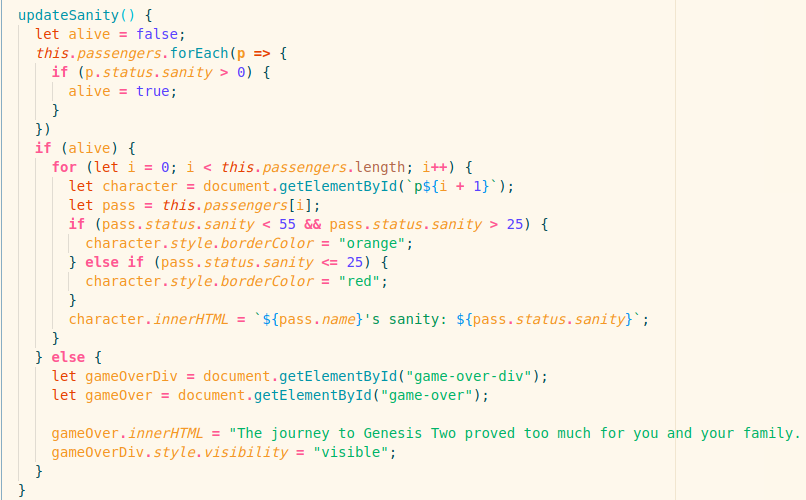

### Nebulas Dream
[Live Link](https://m1ch43l-s1m30n.github.io/nebulas-dream/)

## Technologies used
  * JavaScript (ES6)
  * Canvas
  * HTML
  * CSS
  * Webpack
  * AWS S3

Welcome to Nebula's Dream. This is the HTML canvas game that I developed using JavaScript. The game itself is an original idea, with inspiration taken from the classic game Oregon Trail. The objective is to travel to make the journey to a new planet, while dealing with unexpected obstacles. If you make it without all of your passengers going insane, you win.

## Intro Page

This project in particular took me out of my comfort zone, especially when it came to styling. My vision for this project was to emulate the old-fashioned 8-bit style of Oregon Trail. I had to find the artist deep within me to create a clean project with cohesive styling throughout. The game intro page I think shows this best.

## Hazard

The "difficulty" of this game lies in the handling of the Obstacles that you come across. I made it so that there are pros and cons to both choices in the game. The objective is to make it to the end with as many passengers as possible so its coded so that avoiding the obstacle moderately affects all the passengers where as continuing through it greatly impacts a single passenger. Balancing both of these options leads to a balanced yet completely random playthrough each time.

## Sanity Algorithm

This game's key feature is sanity of each passenger. I created a Passenger class which along with storing that passengers sanity out of 100, had a function which handled randomly slicing the sanity of each passenger as time went by. On top of this when the player had a catastrophe one random passenger would lose a certain amount of sanity. In order to keep track of each character's sanity level I wrote the function above which was repeatedly called after each event. I iterated through `this.passengers` which stored the Passenger objects and based on the sanity level, it updated the color of the border accordingly.

## Future Features
*say that three times fast*

 * Choosing passenger names at the start
 * More detailed Obstacles with custom text for each kind
 * Difficulty toggle

